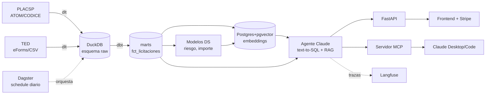

# Arquitectura

## Principio de diseño

Todo el sistema cabe en un VPS de 4 vCPU / 8 GB usando el **stack ligero moderno**:
DuckDB como motor analítico (sin servidor), Postgres+pgvector para app y embeddings,
y la Claude API para la parte de LLM (no se auto-hospeda ningún modelo).

## Flujo de datos

## Capas y responsabilidades

| Capa | Directorio | Tecnología | Responsabilidad |
|------|-----------|-----------|-----------------|
| Ingesta | `ingestion/` | dlt + lxml | Descargar ZIP, parsear CODICE, aterrizar en `raw` |
| Almacén | `data/` | DuckDB | Motor analítico columnar embebido |
| Transformación | `transform/` | dbt-duckdb | staging → intermediate → marts + tests |
| Orquestación | `orchestration/` | Dagster | Assets con linaje + schedule diario |
| Data Science | `analytics/` | scikit-learn, statsmodels | Riesgo, importe con incertidumbre, segmentación |
| Vectorial | (Postgres) | pgvector | Embeddings para búsqueda híbrida y matching |
| Agente | `api/agent/` | Claude API | text-to-SQL, RAG, guardrails |
| API | `api/` | FastAPI | Endpoints REST + auth + Stripe |
| MCP | `mcp_server/` | mcp SDK | Exponer datos como tools a Claude Desktop |
| Evals | `evals/` | Ragas, LLM-as-judge | Calidad del agente |
| Observabilidad | (servicio) | Langfuse | Trazas, coste, latencia |

## Decisiones clave

- **DuckDB vs data warehouse cloud:** coste cero, rendimiento sobrado para el
  volumen (millones de filas), y cabe en el VPS. Es la tendencia real del sector.
- **Claude API con prompt caching:** el system prompt (esquema + reglas) se cachea,
  abaratando cada consulta del agente.
- **text-to-SQL de solo lectura con guardrails:** el agente nunca modifica datos;
  se validan las consultas antes de ejecutarlas (ver `api/agent/tools.py`).
- **Señales de riesgo, no acusaciones:** encuadre legal por diseño (RGPD, difamación).
